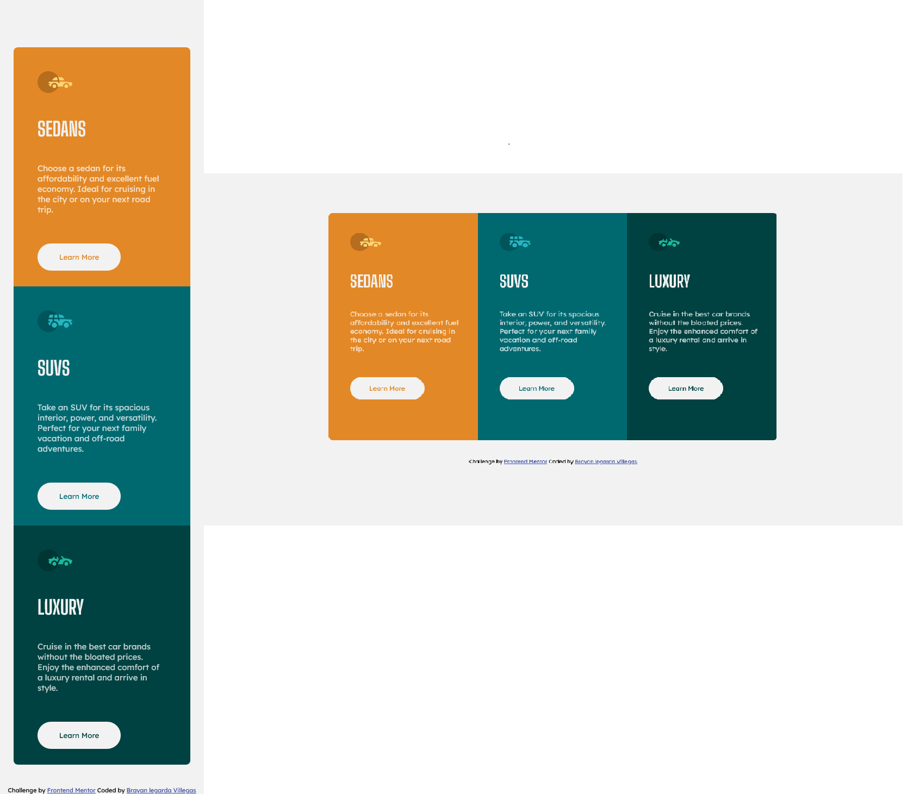

  <h2>3 Column Preview Card Component Solution</h2>
  

    <a href="https://www.frontendmentor.io/challenges/3column-preview-card-component-pH92eAR2-" target="_blank"><strong>Frontend Mentor Challenge</strong></a>
  

### The challenge

Users should be able to:

- View the optimal layout depending on their device's screen size
- See hover states for interactive elements

### Screenshot

### Links

<a href="https://brayanlegarda1.github.io/3-column-preview-card-component/" target="_blank">View Demo</a>

### Acknowledgment

- Challenge was provided by [Frontend Mentor](https://www.frontendmentor.io)

### Built with

- Semantic HTML5 markup
- CSS custom properties
- Flexbox
- Mobile-first workflow
